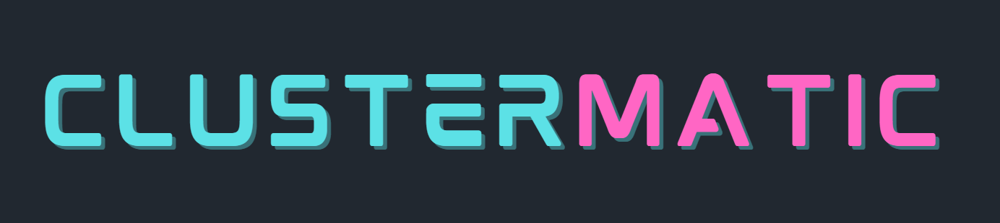

`clustermatic` is a Python library designed to accelerate clustering tasks using `scikit-learn`. It serves as a quick tool for selecting the optimal clustering algorithm and its hyperparameters, providing visualizations and metrics for comparison.

## Features

- **Evaluation Metrics**: Supports evaluation with `silhouette`, `calinski_harabasz` and `davies_bouldin` scores.
- **Optimization Methods**: Includes Bayesian optimization & random search for hyperparameter tuning.
- **Clustering Algorithms**: Analyzes 6 clustering algorithms from `scikit-learn`:
    - `KMeans`
    - `DBSCAN`
    - `MiniBatchKMeans`
    - `AgglomerativeClustering`
    - `OPTICS`
    - `SpectralClustering`
- **Report Generation**: Generates reports in HTML format after optimization.
